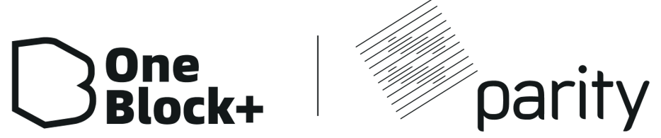
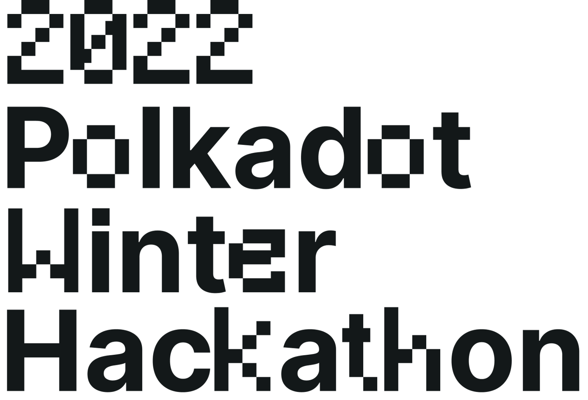

<br/>
<br/>



<br/>

---


# Gear 合约入门介绍

<div class="columns">
<div>

<h3>
<details open><summary>智能合约特性和开发范例</summary>

<div class="columns">
<p align="center" class="qr">
  
</p>

<p align="center" class="gitpod">
  <a href="https://gitpod.io/#https://github.com/btwiuse/oneblock-gear-workshop-2022" target="_blank">
    
  </a>
</p>
<div/>

</details>
</h3>

## Hangbiao

### ⚙️ Validator Manager

</div>
<div>

- #### 什么是 Gear
  - **Rust 与 WebAssembly**
  - **Hello World**
- #### Actor 模型
  - **Processing**
  - **Communication**
  - **State**
- #### 开发范例

</div>
</div>

---


# 什么是 Gear

## 基于 Substrate 的智能合约平台 (PoS, L1)

<div class="columns">
<div>

### Actor Model

### Persistent Memory

### WebAssembly

</div>
<div>

<details><summary>Vara Standalone Network</summary>

```
...
    {
      "prefix": 137,
      "network": "vara",
      "displayName": "Vara Network",
      "symbols": ["VARA"],
      "decimals": [12],
      "standardAccount": "*25519",
      "website": "https://vara-network.io/"
    },
...
```

Coming soon! ([source](https://github.com/paritytech/ss58-registry/blob/13019a7d23901c499d97855ba6c2145962c42fd0/ss58-registry.json#L787-L795))

</details>

<details><summary>Kusama & Polkadot Parachain</summary>

Stay tuned!

</details>

</div>
</div>

<!-- 近期将上线 Vara Network 主网 -->

---


# Rust 与 WebAssembly

## WebAssembly: 高效、可移植的二进制指令格式 (W3C标准)

- Rust / C / C++ / Zig / AssemblyScript ...

## Rust: 多范式通用编程语言 (Safety, Speed, Concurrency)

- 完善的工具链
  - `wasm32-unknown-unknown` [Tier 2](https://doc.rust-lang.org/rustc/platform-support.html#tier-2)
  - [no_std](https://docs.rust-embedded.org/book/intro/no-std.html) -> [gstd](https://docs.gear.rs/gstd/)
- `cargo` 包管理器 + 丰富的第三方库 [crates.io/categories/no-std](https://crates.io/categories/no-std)
- 各类插件: `rustfmt`, `cargo-clippy`, `rust-analyzer`, ...

---


# Hello World

## `cargo new`

```
$ cargo new hello-gear && cd hello-gear
```

## `cargo add`

```
$ cargo add --git ...
```

---


## `./rust-toolchain`

```
[toolchain]
channel = "nightly"
components = [ "rustfmt", "clippy" ]
targets = [ "wasm32-unknown-unknown" ]
profile = "minimal"
```

## `./src/lib.rs`

```
#![no_std]

#[no_mangle]
extern "C" fn handle() {
  let _ = gstd::msg::load_bytes(); // read input message and do nothing 
}
```

---


## `./build.rs`

```
fn main() {
    gear_wasm_builder::build();
}
```

## `cargo build --release`

- `./target/wasm32-unknown-unknown/release/*.opt.wasm`
  - 合约代码 (Code)
  - 提交上链 -> CodeId -> 部署 (+salt) -> ProgramId
- `./target/wasm32-unknown-unknown/release/*.meta.wasm`
  - 合约 Metadata
  - @gear-js/api

---


# 开发者常用工具/库/参考范例

<div class="columns">
<div>

## 合约 (Program) 相关
- [gcore](https://docs.gear.rs/gcore/) 基础类型定义
- [gstd](https://docs.gear.rs/gstd/) 标准库
- [gtest](https://docs.gear.rs/gtest/) 编写测试

## 交互
- [gclient](https://docs.gear.rs/gclient/) Rust 客户端
- [@gear-js/api](#) JavaScript/TypeScript 客户端
- [create-gear-app](#) 前端模板生成工具

</div>
<div>

## 工具
- [@gear-js/gear-meta](#) 基于 `.meta.wasm` 编解码消息 CLI
- [Gear Idea](#) 合约部署 GUI

## 参考范例

- [gear-dapps/](https://github.com/gear-dapps/)
  - [app](https://github.com/gear-dapps/app) 合约模板 
  - [fungible-token](#), [non-fungible-token](#), [dao](#), [oracle](#), [RMRK](#) ...

</div>

</div>

---

# Actor 模型


---


## 账户体系

[`gstd::ActorId`](https://docs.gear.rs/gstd/struct.ActorId.html) 256-bit Unique Identifier

> Gear allows users and programs to interact with other users and programs via messages. Source and target program as well as user are represented by 256-bit identifier ActorId struct.

- 📝 合约(Program)地址 (aka ProgramId), 例如
  `0x512905fcf25de5e576c5c9302b75efd68372e9d835945089f046f6170a0ef91a`
- 🐱 用户地址 (即 SS58 公钥), 例如:
  `0xd43593c715fdd31c61141abd04a99fd6822c8558854ccde39a5684e7a56da27d`
  - `5GrwvaEF5zXb26Fz9rcQpDWS57CtERHpNehXCPcNoHGKutQY` //Alice
  - [ss58.org](https://ss58.org)

---


# Processing

---


# Communication

---


# State

---


# 开发范例

<div class="columns">

<div>

##### Decentralized Finance (DeFi)
##### Decentralized Autonomous Orgs (DAOs)
##### Non-fungible Tokens (NFTs)
##### Staking

</div>

<div>

##### Wallets
##### Tools&Explorers
##### Web3/eCommerce
##### Oracles

</div>

</div>
